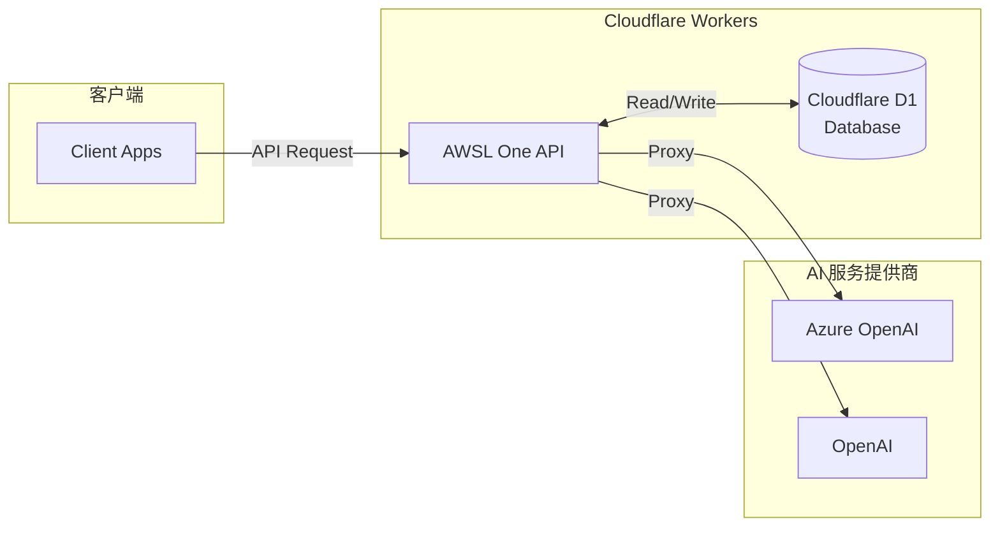

# AWSL One API

一个基于 Cloudflare Workers 的 OpenAI API 代理服务，支持多渠道管理、Token 管理和使用量统计。

## ✨ 特性

- 🚀 **基于 Cloudflare Workers**：无服务器架构，全球边缘部署
- 🔐 **多渠道支持**：支持 Azure OpenAI 和 OpenAI，后续会继续增加其他 AI 服务提供商
- 🎫 **Token 管理**：完整的 API Token 生成、管理和配额控制
- 📊 **使用量统计**：实时统计 API 使用量和费用
- 💰 **定价管理**：灵活的模型定价配置
- 🎨 **Web 管理界面**：直观的 Web 界面进行配置管理
- 🧪 **API 测试工具**：内置 API 测试功能，支持实时调试
- 📚 **OpenAPI 文档**：自动生成的 API 文档

## 🏗️ 系统架构



<details>
<summary>📁 项目结构</summary>

```text
awsl-one-api/
├── src/                          # 源代码目录
│   ├── admin/                    # 管理接口
│   │   ├── channel_api.ts        # 频道管理 API
│   │   ├── token_api.ts          # Token 管理 API
│   │   ├── pricing_api.ts        # 定价管理 API
│   │   ├── db_api.ts             # 数据库管理 API
│   │   └── index.ts              # 管理接口路由
│   ├── providers/                # AI 服务提供商
│   │   ├── azure-openai-proxy.ts # Azure OpenAI 代理
│   │   ├── openai-proxy.ts       # OpenAI 代理
│   │   └── index.ts              # 提供商路由
│   ├── db/                       # 数据库相关
│   ├── model/                    # 数据模型
│   ├── constants.ts              # 常量定义
│   ├── utils.ts                  # 工具函数
│   └── index.ts                  # 主入口文件
├── public/                       # 静态文件
│   └── index.html                # Web 管理界面
├── type.d.ts                     # 类型定义
├── wrangler.toml                 # Cloudflare Workers 配置
└── package.json                  # 项目配置
```

</details>

## 🚀 快速开始

### 环境要求

- Node.js 18+
- pnpm
- Cloudflare Workers 账户

### 安装依赖

```bash
pnpm install
```

### 配置环境

1. 复制 `wrangler.toml.template` 为 `wrangler.toml` 并修改配置：

```toml
name = "awsl-one-api"
main = "src/index.ts"
compatibility_date = "2025-04-28"
routes = [
    { pattern = "your-domain.com", custom_domain = true },
]

[vars]
ADMIN_TOKEN = "your-secure-admin-token-here"

[assets]
directory = "public"
binding = "ASSETS"
run_worker_first = true

[[d1_databases]]
binding = "DB"
database_name = "your-database-name"
database_id = "your-database-id"
```

1. 创建 Cloudflare D1 数据库：

```bash
wrangler d1 create awsl-one-api
```

### 本地开发

```bash
pnpm dev
```

### 部署到生产环境

```bash
pnpm run deploy
```

<details>
<summary>📖 使用指南</summary>

### 初始化数据库

首次部署后，需要通过 Web 界面初始化数据库：

1. 访问 `https://your-domain.com`
2. 使用管理员 Token 登录
3. 切换到 **📊 数据库** 标签
4. 点击 **🔄 初始化数据库** 按钮

### 频道配置

1. 在 Web 界面切换到 **🔗 频道管理** 标签
2. 点击 **➕ 添加频道** 按钮
3. 选择频道类型（Azure OpenAI 或 OpenAI）
4. 填写频道标识和配置信息：
   - 对于 OpenAI：填写基本信息（名称、端点、API密钥）和模型映射配置
   - 对于 Azure OpenAI：还需要配置 API 版本和模型部署映射
5. 点击 **💾 保存频道** 按钮

**提示**：系统会根据选择的频道类型自动显示相应的配置字段。

### Token 创建和使用

1. 在 Web 界面切换到 **🔑 令牌管理** 标签
2. 点击 **➕ 添加令牌** 按钮
3. 填写令牌名称，系统会自动生成 `sk-` 开头的 Token
4. 配置允许访问的频道和配额
5. 点击 **💾 保存令牌** 按钮
6. 使用 **📋 复制** 按钮获取 Token 用于 API 调用

### OpenAI 兼容 API

本项目提供完全兼容的 OpenAI API 接口：

```bash
curl https://your-domain.com/v1/chat/completions \
  -H "Content-Type: application/json" \
  -H "Authorization: Bearer YOUR_API_TOKEN" \
  -d '{
    "model": "gpt-4",
    "messages": [
      {
        "role": "user",
        "content": "Hello, world!"
      }
    ]
  }'
```

### API 测试工具

管理界面内置了强大的 API 测试工具，无需额外工具即可进行 API 调试：

#### 功能特性

- **🚀 一键测试**：直接在 Web 界面中测试 API 调用
- **📝 JSON 编辑器**：支持 JSON 格式验证和语法高亮
- **⚡ 实时响应**：显示响应时间、状态码和完整响应内容
- **🔍 错误诊断**：自动区分 HTTP 错误和 JSON 响应，便于排查问题
- **📋 一键复制**：支持复制 Token 和响应内容

#### 使用步骤

1. 访问管理界面，切换到 **🧪 API 测试** 标签
2. 输入你的 API Token（可从令牌管理页面复制）
3. 编辑请求 JSON（预填充标准格式）
4. 点击 **🚀 发送请求** 按钮
5. 查看响应结果和状态信息

</details>

## 🛠️ 管理功能

### Web 管理界面

访问 `https://your-domain.com` 即可使用 Web 管理界面，功能包括：

- **📊 数据库管理**：一键初始化数据库表结构
- **🔗 频道配置管理**：添加、编辑、删除 AI 服务提供商频道（支持 Azure OpenAI 和 OpenAI）
- **🔑 API Token 管理**：生成、管理和监控 API Token 使用情况
- **💰 定价配置**：灵活配置不同模型的定价策略
- **🧪 API 测试工具**：内置 API 测试界面，支持实时调试和错误排查

#### 管理界面特性

- **现代化 UI**：响应式设计，支持桌面和移动设备
- **实时反馈**：操作结果即时显示，支持悬浮提示
- **智能表单**：自动生成 Token、JSON 格式验证、一键复制功能，根据频道类型智能显示配置字段
- **安全认证**：管理员 Token 认证，数据安全保护

## 🔧 配置说明

### 渠道配置

目前支持以下 AI 服务提供商：

#### Azure OpenAI 配置

```json
{
  "name": "My Azure OpenAI",
  "type": "azure-openai",
  "endpoint": "https://your-resource.openai.azure.com/",
  "api_key": "your-azure-api-key",
  "api_version": "2024-02-15-preview",
  "deployment_mapper": {
    "gpt-4": "gpt-4-deployment-name",
    "gpt-3.5-turbo": "gpt-35-turbo-deployment-name"
  }
}
```

#### OpenAI 配置

```json
{
  "name": "My OpenAI Channel",
  "type": "openai",
  "endpoint": "https://api.openai.com/v1/",
  "api_key": "sk-your-openai-api-key",
  "deployment_mapper": {
    "gpt-4": "gpt-4",
    "gpt-3.5-turbo": "gpt-3.5-turbo"
  }
}
```

**配置说明**：

- `name`: 频道显示名称
- `type`: 服务提供商类型（`azure-openai` 或 `openai`）
- `endpoint`: API 端点地址
- `api_key`: API 密钥
- `api_version`: API 版本（仅 Azure OpenAI 需要）
- `deployment_mapper`: 模型名称映射关系（用于自定义模型名称映射）

### Token 配置

支持详细的 Token 配置，包括名称、访问权限和配额管理：

```json
{
  "name": "用户令牌1",
  "channel_keys": ["azure-openai-1", "azure-openai-2"],
  "total_quota": 1000000
}
```

**配置说明**：

- `name`: Token 名称，便于管理识别
- `channel_keys`: 允许访问的频道列表，空数组表示允许所有频道
- `total_quota`: 总配额（基础单位：1百万 token = $1.00）

## 📊 监控与统计

- **使用量统计**：自动记录每次 API 调用的 Token 使用量
- **费用计算**：基于模型定价自动计算费用
- **配额管理**：支持 Token 级别的配额限制
- **实时监控**：Web 界面实时显示使用情况和剩余配额

## 🎯 核心优势

- **零配置部署**：基于 Cloudflare Workers，无需服务器维护
- **全球加速**：利用 Cloudflare 全球边缘网络，低延迟访问
- **成本优化**：按需计费，无固定服务器成本
- **高可用性**：Cloudflare 基础设施保证 99.9% 可用性
- **安全可靠**：内置 Token 认证和配额管理机制

## 🔒 安全性

- **Token 认证**：所有 API 调用需要有效的 Bearer Token
- **管理员认证**：管理接口使用独立的管理员 Token
- **CORS 支持**：配置跨域访问策略

## 📚 API 文档

部署后可访问以下地址查看完整 API 文档：

- Swagger UI: `https://your-domain.com/api/docs`
- ReDoc: `https://your-domain.com/api/redocs`
- OpenAPI JSON: `https://your-domain.com/api/openapi.json`

## 🤝 贡献

欢迎提交 Issue 和 Pull Request！

## 📄 许可证

MIT License

## 🙋‍♂️ 支持

如有问题或建议，请创建 Issue 或联系维护者。
